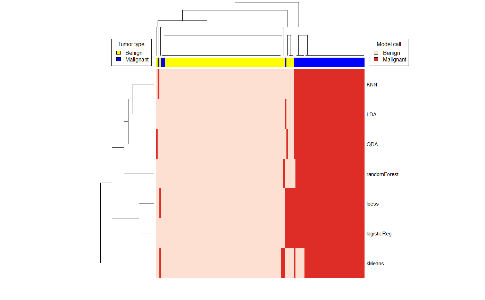

```{r setup, include=FALSE}
knitr::opts_chunk$set(echo = FALSE)
```


```{r message=FALSE}
library(tidyverse)
library(RColorBrewer)
library(gplots)
library(GGally)
library(factoextra)
library(matrixStats)
library(caret)
options(digits = 3)
```

## Introduction

### Background

The purpose of breast tumor biopsy is to differentiate breast cancer from benign masses. Most breast tumors are not cancerous, but it is critical to correctly identify malignant tumors. Because advanced breast cancer is life-threatening, a false negative test result that misses a diagnosis could be a fatal error. It is also important to reduce false positives and correctly identify patients who have benign masses, both to reduce unwarranted psychological and financial distress associated with a cancer diagnosis and to avoid morbidity from unnecessary cancer treatment.

Many breast tumors are assessed by fine needle aspiration (FNA) cytology, the most cost-effective and least invasive biopsy method (Mitra and Dey, 2016). FNA consists of using a thin needle to extract a piece of the tumor, which a pathologist analyzes for physical features that distinguish malignant cells. However, FNA biopsy accuracy changes dramatically with experience of the cytopathologist (Feoli et al., 2008). The false negative rate is variable across studies, with many recent studies showing a 5-10% false negative rate and some centers reporting rates of 15% or greater (Mitra and Dey, 2016). There has been a movement away from use of FNA towards the more invasive and expensive core needle biopsy method, which is widely reputed to be better, although studies show that FNA and core needle biopsy have similar false negative rates of 1.7% when performed by an experienced cytopathologist (Brancato et al., 2012).

Digital analysis of breast biopsies could potentially reduce the disparity in FNA false negative rates. Cytology relies on visual pattern matching of cellular features by the pathologist, and these pattern matching strategies can be mimicked through machine learning. A classifier could supplement the opinion of a cytopathologist, potentially compensating for lack of pathologist experience and providing an accessible and objective second opinion about ambiguous samples. The model could also serve as a teaching tool and highlight which features are most useful for visually distinguishing cancer and normal tissue.

The goal of this study was to train a machine learning classifier to predict whether a breast tumor is malignant (cancer) or benign (not cancer) based on cell nucleus features extracted from digitized images of FNA cytology slides. A useful model should classify tumors better than the worst performing real pathologists (15% false negative rate) in order to be potentially beneficial as a training tool or supplement for this population. 

### The dataset

The [Breast Cancer Wisconsin Diagnostic Dataset](https://archive.ics.uci.edu/ml/datasets/Breast+Cancer+Wisconsin+%28Diagnostic%29) consists of 30 features computationally extracted from digital images of FNA biopsy slides of a consecutive series of 569 breast tumors (Street et al., 1993). Features describe properties of the cell nuclei, including attributes related to nucleus size, shape and regularity. For each feature, the average value of the feature across all cells in the image, standard error of the feature across all nuclei (se), and most extreme (worst) value of the feature in the image are reported. Here is a description of the 10 base variables, each of which has a mean, standard error, and worst value:

* `radius`: Nucleus radius (mean of distances from center to points on the perimeter).
* `texture`: Nucleus texture (standard deviation of gray-scale values).
* `perimeter`: Nucleus perimeter.
* `area`: Nucleus area.
* `smoothness`: Nucleus smoothness (local variation in radius lengths).
* `compactness`: Nucleus compactness (perimeter^2/area - 1).
* `concavity`: Nucleus concavity (severity of concave portions of the contour).
* `concave_pts`: Number of concave portions of the nucleus contour.
* `symmetry`: Nucleus symmetry.
* `fractal_dim`: Nucleus fractal dimension ("coastline approximation" - 1).

### Approach

The dataset was imported from  UCI Machine Learning Repository. Individual features were centered and scaled. Exploratory data analysis revealed clustering of samples based on tumor type and showed that tumor type is the primary source of feature variation between samples. The data were split into an 80% training set and 20% test set, then used to train 7 different machine learning models, which were combined into an ensemble. Model performance was evaluated on the test set using accuracy as a primary measure and false negative rate as a secondary measure. 

### Performance

The best two models, k-nearest neighbors and linear discriminant analysis, each yielded a 97.4% accuracy and 7% false negative rate. The 7-model ensemble had a slightly lower accuracy and false negative rate (96.5% and 9.3% respectively). Importantly, this project replicates a prior analysis on this dataset that used a multisurface method tree to achieve an accuracy of 97.5% (Wolberg et al., 1995), so the accuracy level is consistent with the literature. The false negative rate is consistent with that of professional cytopathologists and may represent an improvement over some least experienced pathologists.

## Methods

### Data import and wrangling

The dataset was imported from the [UCI Machine Learning Repository](https://archive.ics.uci.edu/ml/datasets/Breast+Cancer+Wisconsin+%28Diagnostic%29) as a matrix (samples by features) and an associated vector of tumor type for each sample (malignant or benign). The matrix was scaled by column so that each feature value was reported as a z-score.

```{r}
# import data
url <- "http://mlr.cs.umass.edu/ml/machine-learning-databases/breast-cancer-wisconsin/wdbc.data"
brca_nuclei <- read.csv(url, header = FALSE)

# add variable names - info from wdbc.names file
x <- c("radius", "texture", "perimeter", "area", "smoothness", "compactness", "concavity", "concave_pts", "symmetry", "fractal_dim")
y <- c("mean", "se", "worst")
temp <- expand.grid(x = x, y = y)    # build variable names as all combos of x,y
names(brca_nuclei) <- c("id", "type", paste(temp$x, temp$y, sep = "_"))

# arrange by type to group like samples together
brca_nuclei <- brca_nuclei %>% arrange(type)

# extract numeric features
features <- brca_nuclei %>% select(-id, -type) %>% as.matrix()

# extract tumor type
type <- brca_nuclei$type

# combine features and type into brca object
brca <- list(x = features, y = type)

# scale x values
x_centered <- sweep(brca$x, 2, colMeans(brca$x))
x_scaled <- sweep(x_centered, 2, colSds(brca$x), FUN = "/")
```

### Exploratory data analysis

A heatmap of samples was generated by calculating and plotting the Euclidean distance between samples. A heatmap of features was generated by calculating and plotting the correlation coefficient between features. P-values were calculated using two-tailed independent Student's t-tests. Confidence intervals were calculated using the normal approximation, which was motivated by the apparently normal density of most features when split into benign and malignant groups. Principal component analysis was performed and principal components were investigated for association with tumor type.

### Modeling

The data were split into an 80% training set and 20% test set, which had roughly equal proportions of benign and malignant samples. Seven different models were fit to the training data: k-means, logistic regression, linear discriminant analysis (LDA), quadratic discriminant analysis (QDA), loess, k-nearest neighbors (KNN) and random forest. K-means clustering was performed with 2 centers. Logistic regression, LDA, QDA and loess models were trained with default parameters. The KNN model tested odd values of number of neighbors to consider ranging from 3 to 21, and the best value of $k=9$ was selected using accuracy across 25 bootstrapped samples. The random forest model tested odd values of number of predictors available at each split ranging from 3 to 21 and the best value of `mtry = 7` was selected using accuracy across 25 bootstrapped samples. An ensemble was built using all 7 models that classified samples by majority vote.

The performance of individual algorithms and the ensemble was evaluated using accuracy as the primary outcome and false negative rate as the secondary outcome. Sensitivity and specificity were also reported as tertiary outcomes. Malignant was treated as the positive class.

## Results

### Exploratory analysis

#### Distance between benign and malignant samples

A heatmap of distance between samples shows two main clusters of samples, which correspond to benign and malignant types (Figure \@ref(fig:sample-dist-heatmap)). Benign samples are most similar to other benign samples, and malignant samples are most similar to other malignant samples. Furthermore, malignant samples are less similar to each other than benign samples, as indicated by a wider variance in distance between malignant samples.

```{r sample-dist-heatmap, fig.cap="Heatmap of distance between samples.", fig.height=5, out.width="80%", fig.align="center"}
# heatmap of samples - red spectrum, label malignant blue and benign yellow on cols
heatmap.2(as.matrix(dist(x_scaled)),
          labRow = NA,
          labCol = NA,
          scale = "none",
          col = brewer.pal(9, "Reds"),
          trace = "none",
          density = "none",
          ColSideColors = ifelse(brca$y == "B", "yellow", "blue"),
          key.title = NA,
          key.xlab = "Distance")

# add blue/yellow tumor type legend
legend(0, 0.9, legend=c("Malignant","Benign"),fill=c("blue","yellow"), cex = 0.7)
```

#### Correlation between features

The heatmap of correlation between features demonstrates that many feature combinations encode distinct information, as shown by the fact that there are several independent clusters of features along the primary diagonal that are relatively uncorrelated with each other (Figure \@ref(fig:feature-cor-heatmap)). There are also several features that are highly collinear, shown by dark blue squares along the main diagonal. Nuclear size features such as radius, perimeter and area encode redundant information, as indicated by the dark blue box in the upper right. A second cluster in the center relates to nucleus shape, especially concavity and compactness. Mean and worst values of the same variable tend to cluster, and various standard errors tend to cluster, suggesting variance between nuclear features is potentially informative in and of itself.

```{r feature-cor-heatmap, fig.cap="Heatmap of correlation between features.", out.width="95%", fig.height=6}
# add heatmap of feature correlation - divergent palette
heatmap.2(cor(x_scaled),
          labCol = NA,
          scale = "none",
          trace = "none",
          density = "none",
          key.title = NA,
          key.xlab = "Correlation coefficient (r)",
          col = brewer.pal(9, "RdBu"),
          margins = c(0.5, 9))
```

#### Distributions of individual features

Most of the 30 nuclear features show a significant difference in distribution between benign and malignant samples (Figure \@ref(fig:feature-densities)). In all cases where the distributions for a feature clearly differ between tumor type, the malignant samples have larger values. Features associated with nucleus size (mean and worst area, perimeter and radius) and irregular nuclear shape (mean and worst concavity and number of concave points) have similar distributions with benign samples tightly clustered at low values and malignant samples right shifted with larger standard errors. This suggests that large nucleus size and more irregular nucleus shape are associated with cancer, which is consistent with cancer being a dysregulation of normal cell architecture and behavior. In general, mean and worst values of features differ more clearly across tumor type than standard errors of features.

```{r feature-densities, fig.cap="Density plots of nuclear features across tumor type.", fig.height=8}
# faceted density plots of individual variables
as.data.frame(x_scaled) %>%
    mutate(type = ifelse(brca$y == "B", "Benign", "Malignant")) %>%
    gather("variable", "value", -type) %>%
    ggplot(aes(value, fill = type)) +
    geom_density(alpha = 0.5) +
    theme(axis.text.y = element_blank(), axis.ticks.y = element_blank()) +
    facet_wrap(~ variable, scales = "free", ncol = 3)
```

#### Feature p-values and confidence intervals

All but 4 of the 30 nuclear features are significantly different between benign and malignant tumors at a p-value of 0.05 using a two-tailed independent Student's t-test (Table \@ref(tab:feature-p-values)). The 12 most significantly different variables are all mean and worst features of concave points, concavity, perimeter, area, radius and compactness. The most significantly different attribute was `concave_pts_worst` with a p-value of $1.06 \times 10^{-96}$, shortly followed by other features related to nuclear size and irregular shape. Mean and worst values are more significantly different between cancer and normal tissue than standard errors. Importantly, although the means are significantly different for most variables, the 95% confidence intervals all overlap: even the features most highly associated with cancer are not able to unambiguously classify tumor type individually. This suggests models that combine large numbers of features will perform better than models with single features.

```{r feature-p-values, message=FALSE, warning=FALSE}
## calculate p-values for each variable comparing benign to malignant
# extract sets of benign and malignant observations
benign <- as.data.frame(x_scaled) %>%
    mutate(type = ifelse(brca$y == "B", "Benign", "Malignant")) %>%
    filter(type == "Benign")
malignant <- as.data.frame(x_scaled) %>%
    mutate(type = ifelse(brca$y == "B", "Benign", "Malignant")) %>%
    filter(type == "Malignant")
# calculate p-value for each variable with an independent two-tailed t-test
pvals <- sapply(1:30, function(i){
    benign_vals <- benign[,i]
    malignant_vals <- malignant[,i]
    t.test(benign_vals, malignant_vals)$p.value
})

pvals <- data.frame(variable = names(benign)[1:30], pval = pvals)

# calculate 95% CI for each variable, grouped by type
temp <- as.data.frame(x_scaled) %>%
    mutate(type = ifelse(brca$y == "B", "Benign", "Malignant")) %>%
    gather("variable", "value", -type) %>%
    group_by(type, variable) %>%
    summarize(mean = mean(value),
              se = sd(value),
              ci_lower = mean - qnorm(.975)*se,
              ci_upper = mean + qnorm(.975)*se) %>%
    mutate(ci = paste(round(ci_lower, 3), round(ci_upper,3), sep = " - "))

# create table of benign means and CIs
benign_means <- temp %>% filter(type == "Benign") %>%
    ungroup() %>% select(variable, benign_mean = mean, benign_ci = ci)

# create table of malignant means and CIs
malignant_means <- temp %>% filter(type == "Malignant") %>%
    ungroup() %>% select(variable, malignant_mean = mean, malignant_ci = ci)

# join benign/malignant means, CIs, p-values and significance labels
results_table <- left_join(benign_means, malignant_means) %>%
    left_join(pvals) %>%
    mutate(significance = case_when(pval < .001 ~ "***",
                                    pval < .01 ~ "**",
                                    pval < .05 ~ "*",
                                    TRUE ~ "")) %>%
    arrange(pval) %>%    # sort by smallest p-value
    mutate(pval = as.character(signif(pval, digits = 3))) # convert pvals for kable

# change names for kable
names(results_table) <- c("Variable", "Benign mean", "Benign 95% CI", "Malignant mean",
                          "Malignant 95% CI", "P-value", "Significance")

# print with kable
results_table %>% knitr::kable(align = "c", caption = "Feature p-values and confidence intervals by tumor type.")
```

#### Principal component analysis

Principal component analysis shows that the first principal component (PC) accounts for 44.3% of the variance, the second PC accounts for 19.0% of the variance, and every subsequent PC accounts for less than 10% of the variance (Figure \@ref(fig:pca-scree-plot), Table \@ref(tab:pc-importance-table)). Seven PCs explain over 90% of the variance and 10 PCs explain over 95% of the variance. Importantly, a boxplot of principal components by tumor type shows that only the first principal component is clearly associated with benign or malignant status. Malignant tumors have significantly higher levels of PC1 than benign tumors, with no overlap between the IQRs for the two groups (Figure \@ref(fig:pc-boxplot)). A plot of the data using the first 2 PCs shows that PC1 alone is nearly sufficient to separate the samples into benign or malignant classes, though there is some overlap around PC1 values of 0  (Figure \@ref(fig:pca-scatterplot)). Unfortunately, PC1 is not very interpretable: the variable contributing the highest proportion of variance to PC1 (`concave_pts_mean`) only contributes 6.8% of the PC, and 26 of the 30 variables contribute 1% or more to the variance of PC1. There is a rough correspondence between the p-value of a feature's association with tumor type and its contribution to PC1, with highly significant features contributing more to PC1 and unassociated features contributing less than 1% each to PC1 (Table \@ref(tab:percent-pc1-table)).

```{r pca-scree-plot, fig.cap="Scree plot of variance explained by principal components.", out.width="80%", fig.align="center"}
pca <- prcomp(x_scaled) # principal component analysis
fviz_eig(pca)    # scree plot
```

```{r pc-importance-table}
# table of PC importance
summary(pca)$importance[,1:10] %>% knitr::kable(caption = "Variance explained by the first 10 principal components.")
```

```{r pc-boxplot, fig.cap="Principal components by tumor type. The first PC encodes most of the difference between benign and malignant samples.", out.width="80%", fig.align="center"}
# boxplot of PCs 1-10 for each tumor type
data.frame(type = brca$y, pca$x[,1:10]) %>%
    gather(key = "PC", value = "value", -type) %>%
    ggplot(aes(PC, value, fill = type)) +
    geom_boxplot()
```

```{r pca-scatterplot, fig.cap="The first principal component separates samples into benign and malignant clusters.", out.width="80%", fig.align="center"}
# scatterplot of PC2 versus PC1 with an ellipse to show the cluster regions
data.frame(pca$x[,1:2], type = ifelse(brca$y == "B", "Benign", "Malignant")) %>%
  ggplot(aes(PC1, PC2, color = type)) +
  geom_point() +
  stat_ellipse()
```

```{r percent-pc1-table}
# table of variance contributed by each feature to PC1
pca_vars <- get_pca_var(pca)    # get variance contribution of each variable to each PC
data.frame(percent = sort(pca_vars$contrib[,1], decreasing = TRUE)) %>%
    select("Percent of PC1" = percent) %>%
    knitr::kable(caption = "Feature contribution to the variance of PC1. PC1 is not well determined by a small number of variables.")
```

### Conclusions from exploratory analysis

There are significant differences between benign and malignant samples, suggesting it should be possible to find an actionable prediction algorithm. The principal component analysis demonstrates that the most significant source of variance in sample features is whether they are malignant or benign. Furthermore, the first PC informs whether a sample is cancerous, while other PCs differ little between benign and malignant tumors. Features most strongly associated with the first PC tend to be more significantly different between malignant and benign samples. The features most significantly associated with cancer status relate to large nucleus size (radius, perimeter, area) and irregular nucleus shape (concavity, number of concave points, compactness), with mean and worst values of these parameters more strongly associated with tumor type than the standard error of these parameters. Importantly, no single variable is sufficient to distinguish malignant and benign samples, suggesting that the best performing models will incorporate numerous complementary variables.

### Modeling

#### Testing and training sets

The data were split into an 80% training set and 20% test set. The training and test sets had equal proportions of cancer and normal tissue, with 37.2% and 37.4% malignant samples respectively (Table \@ref(tab:train-test-table)).

```{r train-test-table}
# split brca$x and brca$y into 20% test and 80% training sets
set.seed(1)
test_index <- createDataPartition(brca$y, times = 1, p = 0.2, list = FALSE)
test_x <- x_scaled[test_index,]
test_y <- brca$y[test_index]
train_x <- x_scaled[-test_index,]
train_y <- brca$y[-test_index]

# table of train/test proportions of benign/malignant
data.frame(Dataset = c("Train", "Test"),
           Benign = c(mean(train_y == "B"), mean(test_y == "B")),
           Malignant = c(mean(train_y == "M"), mean(test_y == "M"))) %>%
    knitr::kable(caption = "Proportions of benign and malignant tumors in training and test sets.")
```

#### Individual models

Seven models were trained and their performance was assessed on the test set (Table \@ref(tab:performance-metrics-table)). The best performing models are LDA and KNN with an accuracy of 0.974. These models have identical sensitivities for malignant samples of 0.930 and both have a perfect specificity of 1, correctly identifying all benign samples. These two models, along with logistic regression and loess, are tied for the lowest false negative rate of 7%. The best-performing models, LDA and KNN, are not easily interpretable. To get a sense of which variables drive classification, variable importance was extracted from the random forest model, which had an accuracy of 0.948 and was the best performing model for which importance can be calculated (Figure \@ref(fig:feature-importance)). Variable importance was measured in mean decrease in Gini index. 5 variables account for most of the importance: the worst number of concave points in the nucleus outline, worst perimeter, worst area, worst radius and mean number of concave points in the nucleus outline. 

```{r prediction-script, message=FALSE, warning=FALSE}
# function to generate predictions from a k-means model
predict_kmeans <- function(x, k) {
    centers <- k$centers    # extract cluster centers
    # calculate distance to cluster centers
    distances <- sapply(1:nrow(x), function(i){
                            apply(centers, 1, function(y) dist(rbind(x[i,], y)))
                 })
  max.col(-t(distances))  # select cluster with min distance to center
}

# train k-means model, generate k-means predictions
set.seed(3)
k <- kmeans(train_x, centers = 2) 
kmeans_preds <- ifelse(predict_kmeans(test_x, k) == 1, "B", "M")

# train logistic regression model, generate regression predictions
train_glm <- train(train_x, train_y, method = "glm")
glm_preds <- predict(train_glm, test_x)

# train LDA model, generate LDA predictions
train_lda <- train(train_x, train_y, method = "lda")
lda_preds <- predict(train_lda, test_x)

# train QDA model, generate QDA predictions
train_qda <- train(train_x, train_y, method = "qda")
qda_preds <- predict(train_qda, test_x)

# train loess model, generate loess predictions
set.seed(5)
train_loess <- train(train_x, train_y, method = "gamLoess")
loess_preds <- predict(train_loess, test_x)

# train KNN model, find best k, generate predictions
set.seed(7)
tuning <- data.frame(k = seq(3, 21, 2))    # try odd values of k from 3 to 21
train_knn <- train(train_x, train_y,
      method = "knn", 
      tuneGrid = tuning)
knn_preds <- predict(train_knn, test_x)    # generate predictions

# train random forest model, find best mtry, generate predictions, measure accuracy
set.seed(9)
tuning <- data.frame(mtry = seq(3, 21, 2))    # try odd values of mtry from 3 to 21
train_rf <- train(train_x, train_y,
                  method = "rf",
                  tuneGrid = tuning,
                  importance = TRUE)
rf_preds <- predict(train_rf, test_x)    # generate predictions
```

```{r performance-metrics-table}
## create data frame of model performance
# model names
models <- c("K means", "Logistic regression", "LDA", "QDA", "Loess", "K nearest neighbors", "Random forest")
# model accuracies
accuracy <- c(mean(kmeans_preds == test_y),
              mean(glm_preds == test_y),
              mean(lda_preds == test_y),
              mean(qda_preds == test_y),
              mean(loess_preds == test_y),
              mean(knn_preds == test_y),
              mean(rf_preds == test_y))
# calculate model sensitivity (rate of correct malignant classification)
sens <- c(sensitivity(factor(kmeans_preds), test_y, positive = "M"),
          sensitivity(factor(glm_preds), test_y, positive = "M"),
          sensitivity(factor(lda_preds), test_y, positive = "M"),
          sensitivity(factor(qda_preds), test_y, positive = "M"),
          sensitivity(factor(loess_preds), test_y, positive = "M"),
          sensitivity(factor(knn_preds), test_y, positive = "M"),
          sensitivity(factor(rf_preds), test_y, positive = "M"))
# calculate model specificity (rate of correct benign classification)
specif <- c(sensitivity(factor(kmeans_preds), test_y, positive = "B"),
          sensitivity(factor(glm_preds), test_y, positive = "B"),
          sensitivity(factor(lda_preds), test_y, positive = "B"),
          sensitivity(factor(qda_preds), test_y, positive = "B"),
          sensitivity(factor(loess_preds), test_y, positive = "B"),
          sensitivity(factor(knn_preds), test_y, positive = "B"),
          sensitivity(factor(rf_preds), test_y, positive = "B"))
# data frame of model performance
data.frame(Model = models, Accuracy = accuracy, Sensitivity = sens, Specificity = specif) %>%
  mutate("False Negative Rate" = 1-Sensitivity) %>%
  knitr::kable(caption = "Performance metrics for machine learning classifiers.")
```

```{r feature-importance, fig.cap="Importance of random forest features.", out.width="80%"}
# calculate importance of final random forest model
rf_imp <- randomForest::importance(train_rf$finalModel) %>% data.frame()
varnames <- rownames(rf_imp)    # extract row names

# make a plot of mean decrease in Gini index for each variable
rf_imp %>%
    mutate(Variable = varnames,
           Variable = reorder(Variable, -MeanDecreaseGini)) %>%
    ggplot(aes(Variable, MeanDecreaseGini)) +
    geom_bar(stat = "identity") +
    theme(axis.text.x = element_text(angle = 45, hjust = 1))
```

#### Ensemble models

A heatmap of model predictions shows a core set of benign and malignant tumors that are correctly classified by all 7 models, a small number of benign samples that are incorrectly classified by loess and logistic regression, 2 small clusters of malignant samples that are only sometimes correctly classified, and a small cluster of malignant samples that is not identified by any algorithm (Figure \@ref(fig:model-pred-heatmap)). The two top algorithms, KNN and LDA, have identical accuracies of 0.974 and perfect classification of benign samples (specificity = 1), but they identify different subsets of malignant samples.

```{r make-ensemble}
# generate ensemble by building a matrix of all model predictions
ensemble <- cbind(kMeans = ifelse(kmeans_preds == "B", 0, 1),
                  logisticReg = ifelse(glm_preds == "B", 0, 1),
                  LDA = ifelse(lda_preds == "B", 0, 1),
                  QDA = ifelse(qda_preds == "B", 0, 1),
                  loess = ifelse(loess_preds == "B", 0, 1),
                  KNN = ifelse(knn_preds == "B", 0, 1),
                  randomForest = ifelse(rf_preds == "B", 0, 1))

```


```{r model-pred-heatmap, fig.cap = "Predictions of tumor type across seven models.", out.width="90%", fig.height=9}
# code for creating graphic below


# code for creating heatmap with two color legends - exported as image to standardize format
#benign_col = brewer.pal(3, "Reds")[1] 
#malignant_col = brewer.pal(3, "Reds")[3]
#heatmap(t(ensemble), labCol = NA,
#        col = brewer.pal(3, "Reds"),
#        ColSideColors = ifelse(test_y == "B", "yellow", "blue"))
#legend(0.19, 0.9, legend=c("Benign","Malignant"), fill=c("yellow", "blue"), title = "Tumor type")
#legend(0.77, 0.9, legend=c("Benign","Malignant"), fill=c(benign_col, malignant_col), title = "Model call")
```

The seven models have mostly consistent results on benign samples and are more variable on malignant samples (Table \@ref(tab:classification-rate-table)). Of the benign samples in the test set, all models correctly classified 88.9% (64/72) and no samples were incorrectly classified by more than half of the models. In contrast, only 76.7% (33/43) of malignant samples in the test set were correctly classified by all models, and 9.3% (4/43) of cancers were incorrectly classified by over half of the models, including 4.7% (2/43) that no model called correctly.


```{r classification-rate-table}
table(rowSums(ensemble), ifelse(test_y=="B", "Benign", "Malignant")) %>%
    knitr::kable(caption = "Number of models classifying a sample as malignant by tumor type.")
```


In an attempt to improve performance beyond that of individual models, an ensemble model was built that classified samples by majority vote from all 7 models (Table \@ref(tab:ensemble-table)). This ensemble performed slightly worse than the two top individual models, KNN and LDA (accuracy 0.965 versus 0.974, false negative rate 0.093 versus 0.07), although it correctly identified all benign samples (specificity = 1). 

```{r ensemble-table}
# generate predictions from 7-model ensemble
ensemble_preds <- ifelse(rowMeans(ensemble) < 0.5, "B", "M")

data.frame(Model = "7-model ensemble",
           Accuracy = mean(ensemble_preds == test_y),
           Sensitivity = sensitivity(factor(ensemble_preds), test_y, positive = "M"),
           Specificity = sensitivity(factor(ensemble_preds), test_y, positive = "B")) %>%
    mutate("False Negative Rate" = 1 - Sensitivity) %>%
    knitr::kable(caption = "Performance metrics for ensemble model. The individual KNN and LDA models perform slightly better.")
```

## Discussion

The purpose of this study was to develop a machine learning model to classify breast tumor biopsy samples as malignant or benign using features of cell nuclei extracted fine needle aspirate cytology images. The model accuracy needed to be comparable to the original peer-reviewed analysis of this dataset (Wolberg et al., 1995), which trained a multisurface model tree algorithm that achieved an accuracy of 97.5%. The two best individual models, KNN and LDA, both achieved accuracies of 97.4% on the test set. The equivalent accuracies suggest the current analysis was performed correctly and that these models reproducibly identify features that can classify almost all breast biopsies as benign or malignant.

Furthermore, in order to be potentially useful in the clinic, this model needed to perform better than the worst reported false negative rate of 15%. The KNN and LDA models both had false negative rates of 7%, better than the performance of the least experienced cytopathologists. This model could provide decision-making support for pathologists diagnosing breast cancer, especially those with less experience. However, it is important to note that FNA biopsy error rates depend both the pathologist's diagnostic skill and the pathologist's competence performing the FNA biopsy procedure (Willems et al., 2012). The models designed here can only compensate for deficiencies in image analysis, not aspirator performance.

For most samples, all seven models agree on whether the tumor is benign or malignant. These algorithms or ones like them could be used in the clinic to flag cytology samples as clearly benign, clearly malignant or ambiguous. This could identify samples that require more careful follow-up or additional analysis, and increase confidence in diagnoses when the pathologist and algorithm agree. When the pathologist thinks a sample is benign but most models suggest the tumor is malignant, then further follow-up could be save a life.

A majority vote ensemble of all 7 models had an accuracy of 96.5% and false negative rate of 9.3%, which is worse than the individual KNN and LDA models. This is because most models fail to recognize the same set of malignant samples. Creating an ensemble of models that make the same errors will not improve the performance of the ensemble. However, individual models are more vulnerable to overfitting than an ensemble. Importantly, the KNN and LDA models had higher accuracy on the test set (97.4%) than on the training set (95.3% for KNN and 94.9% for LDA), suggesting that the accuracy metrics on the test set may be overly optimistic and that the ensemble model may be more appropriate despite its slight decrease in accuracy. A future analysis could include cross-validation of these results on several training and test set partitions to determine whether these models are robust to sampling error.

Another future direction involves applying more machine learning algorithms to the current test, including boosted algorithms that would increase the odds of correctly classifying samples that are routinely assigned incorrectly in other algorithms. Boosting involves an iterative modeling process that progressively prioritizes identifying samples that were incorrect in previous modeling cycles. Addition of more sophisticated models could improve the performance of the ensemble.

In addition, this analysis used only features related to the appearance of the cell nuclei. Cancers have additional morphological features aside from nuclear irregularity that could be informative. Some examples include evidence of mitosis, nucleus-cytoplasm ratio, cellular pleomorphism, properties of cell aggregates, features of nucleoli, lymphocytic infiltration, uniformity of cell shape and size, presence of bare nuclei and cytoplasmic staining features (Garud et al., 2012). Malignant tumors that were incorrectly classified as benign could have normal appearing nuclei but have other distinguishing features. Inclusion of additional digitally extracted features from this list in a diagnostic algorithm could further improve accuracy and reduce false negatives. Pairing of computer vision for extracting such features and machine learning classification could further improve the clinical utility of FNA breast biopsies, reducing the incidence of incorrect diagnosis of breast disease.

## References

B. Brancato, E. Crocetti, S, Bianchi, S. Catarzi, G.G. Risso, P. Bulgaresi, F. Piscioli, M. Scialpi, S. Ciatto, and N. Houssami. Accuracy of needle biopsy of breast lesions visible on ultrasound: audit of fine needle versus core needle biopsy in 3233 consecutive samplings with ascertained outcomes. Breast, 21(4):449-454.

F. Feoli, M. Paesmans, and P. Van Eeckhout. Fine Needle Aspiration Cytology of the Breast: Impact of Experience on Accuracy, Using Standardized Cytologic Criteria. Acta Cytologica, 52:145-151, 2008.

H.T. Garud, D. Sheet, M. Mahadevappa, J. Chatterjee, A.K. Ray and A. Ghosh. Breast fine needle aspiration cytology practices and commonly perceived diagnostic significance of cytological features: A pan-India survey. Journal of Cytology, 29(3):183-189, 2012.

S. Mitra and P. Dey. Fine-needle aspiration and core biopsy in the diagnosis of breast lesions: A comparison and review of the literature. CytoJournal, 13:18, 2016.

I.A. Park and E.K. Ham. Fine needle aspiration cytology of palpable breast lesions: histologic subtype in false negative cases. Acta Cytologica, 41(4):1131–1138, 1997.

W.N. Street, W.H. Wolberg and O.L. Mangasarian. Nuclear feature extraction for breast tumor diagnosis. IS&T/SPIE 1993 International Symposium on Electronic Imaging: Science and Technology, 1905:861-870, San Jose, CA, 1993.

S.M. Willems, C.H.M. van Deurzen, P.J. van Diest. Diagnosis of breast lesions: fine-needle aspiration cytology or core needle biopsy? Journal of Clinical Pathology, 65(4):287-292, 2012.

W.H. Wolberg, W.N. Street, D.M. Heisey, and O.L. Mangasarian. Computer-derived nuclear features distinguish malignant from benign breast cytology. Human Pathology, 26:792-796, 1995. 